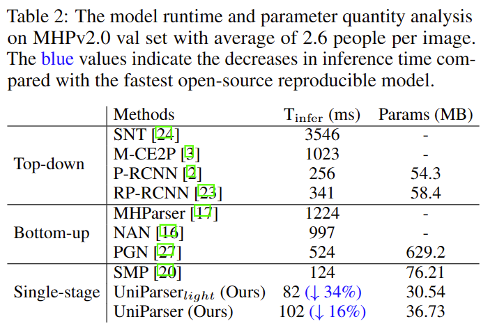

# UniParser: Multi-Human Parsing with 
## Unified Correlation Representation Learning

## Introduction

Multi-human parsing is an image segmentation task necessitating both instance-level and fine-grained category-level information. However, prior research has typically processed these two types of information through separate branches and distinct output formats, leading to inefficient and redundant frameworks. This paper introduces UniParser, which integrates instance-level and category-level representations in three key aspects: 1) we propose a unified correlation representation learning approach, allowing our network to learn instance and category features within the cosine space; 2) we unify the form of outputs of each modules as pixel-level segmentation results while supervising instance and category features using a homogeneous label accompanied by an auxiliary loss; and 3) we design a joint optimization procedure to fuse instance and category representations. By virtual of unifying instance-level and category-level output, UniParser circumvents manually designed post-processing techniques and surpasses state-of-the-art methods, achieving 49.3% AP on MHPv2.0 and 60.4% AP on CIHP.
 
## Differences


## Framework


## Cosine representation


## Performance 

**Better, smaller and faster than SMP!!!**




## Visualization


## Installation

**Step 0.** Download and install Miniconda from the [official website](https://docs.conda.io/en/latest/miniconda.html).

**Step 1.** Create a conda environment and activate it.

```shell
conda create --name SMP python=3.7 -y
conda activate SMP
```
**Step 2.** Install PyTorch following [official instructions](https://pytorch.org/get-started/locally/), e.g.

On GPU platforms:

```shell
conda install pytorch torchvision -c pytorch
```

On CPU platforms:

```shell
conda install pytorch torchvision cpuonly -c pytorch
```

### Our framework is transfering to MMdetection2.0. So, it requires to install MMCV and MMdetection.

**Step 0.** Install [MMCV](https://github.com/open-mmlab/mmcv) using [MIM](https://github.com/open-mmlab/mim).

```shell
pip install -U openmim
mim install mmcv-full==1.7.0
```

**Step 1.**
```shell
git clone https://github.com/cjm-sfw/Uniparser.git
cd Uniparser
pip install -v -e .
```

## Prepare datasets
### MHP2.0
```
.
├── LV-MHP-v2
│   ├── list
│   ├── test
│   │   └── images
│   ├── train
│   │   ├── images
│   │   ├── parsing_annos
│   │   └── pose_annos
│   └── val
│       ├── images
│       ├── parsing_annos
│       └── pose_annos
```

Download from [MHP2.0](https://github.com/ZhaoJ9014/Multi-Human-Parsing)
Paper Citation:
```
@article{zhao2018understanding,
title={Understanding Humans in Crowded Scenes: Deep Nested Adversarial Learning and A New Benchmark for Multi-Human Parsing},
author={Zhao, Jian and Li, Jianshu and Cheng, Yu and Zhou, Li and Sim, Terence and Yan, Shuicheng and Feng, Jiashi},
journal={arXiv preprint arXiv:1804.03287},
year={2018}
}


@article{li2017towards,
title={Multi-Human Parsing in the Wild},
author={Li, Jianshu and Zhao, Jian and Wei, Yunchao and Lang, Congyan and Li, Yidong and Sim, Terence and Yan, Shuicheng and Feng, Jiashi},
journal={arXiv preprint arXiv:1705.07206},
year={2017}
}
```

### Densepose CoCo
Download from [DensePose](https://github.com/facebookresearch/DensePose)

```
.
├── annotations
│   └── DensePose_COCO
|       └──densepose_coco_2014_minival.json
|       └──densepose_coco_2014_test.json
|       └──densepose_coco_2014_train.json
|       └──densepose_coco_2014_valminusminival.json
├── test2014
├── train2014
└── val2014
```

Paper Citation:
```
  @InProceedings{Guler2018DensePose,
  title={DensePose: Dense Human Pose Estimation In The Wild},
  author={R\{i}za Alp G\"uler, Natalia Neverova, Iasonas Kokkinos},
  journal={The IEEE Conference on Computer Vision and Pattern Recognition (CVPR)},
  year={2018}
  }
```

### CHIP
Download from CIHP official pages.
```
.
├── CHIP_train.json
├── CHIP_val.json
├── CIHP_test.json
├── LV-MHP-v2_colormap.mat
├── train_img
├── train_parsing
├── train_seg
├── val_img
├── val_parsing 
└── val_seg
```

### Note
Modify the value of **datatype**, **data_root** and **data** in config files.

## Scrips
**single gpus script.**
```python
python train.py configs/repparsing/MHP_r50_fpn_half_gpu_3x_repparsing_DCN_fusion_metrics.py --gpus 1 --seed 42
```
or
```shell
sh train.sh
```
**distributed train script.**
```shell
bash dist_train.sh configs/repparsing/MHP_r50_fpn_half_gpu_3x_repparsing_DCN_fusion_metrics.py 2
```

## Demo
Completing above preparation, you could run ```demo/inference_demo_parsing.ipynb``` to try infer single image.